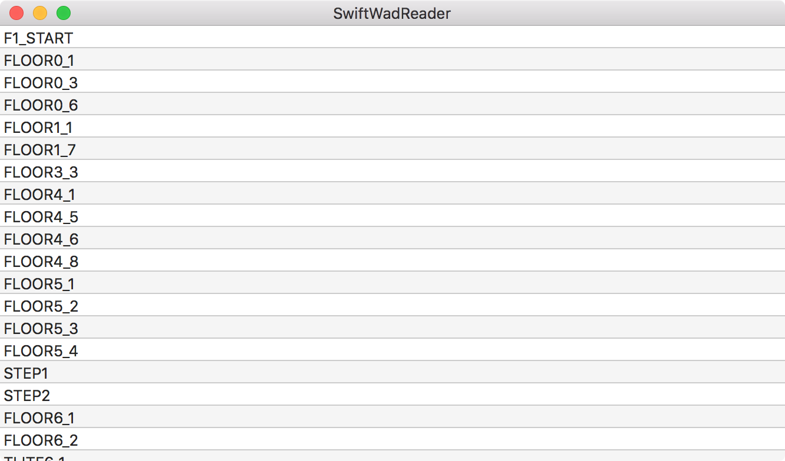

# Swift WAD Reader

This is a simple example to showcase how to use the new `Data` type in Swift 3 to read binary data from a file into the correct structures in memory.

There's an accompagniying blog post on [appventure.me](http://appventure.me). The will read an Doom WAD file and parse it in order to display a couple of the items (*Lumps*, in Doom parlance). If you don't have a Doom WAD file handy, the app can download one for you automatically. 

Here's a screenshot.

Have fun

You can find me on Twitter as [@terhechte](http://twitter.com/terhechte)

